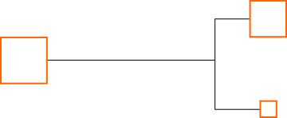
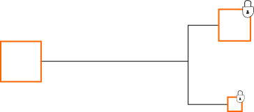
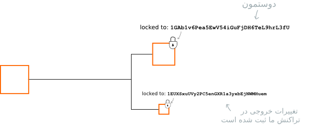
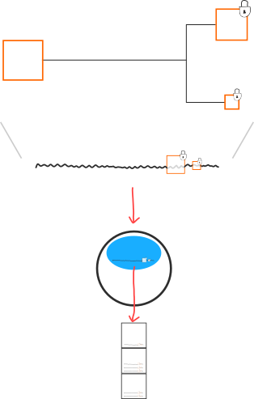
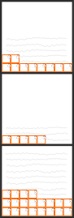
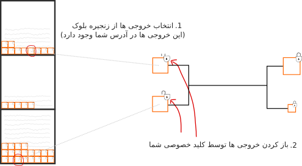
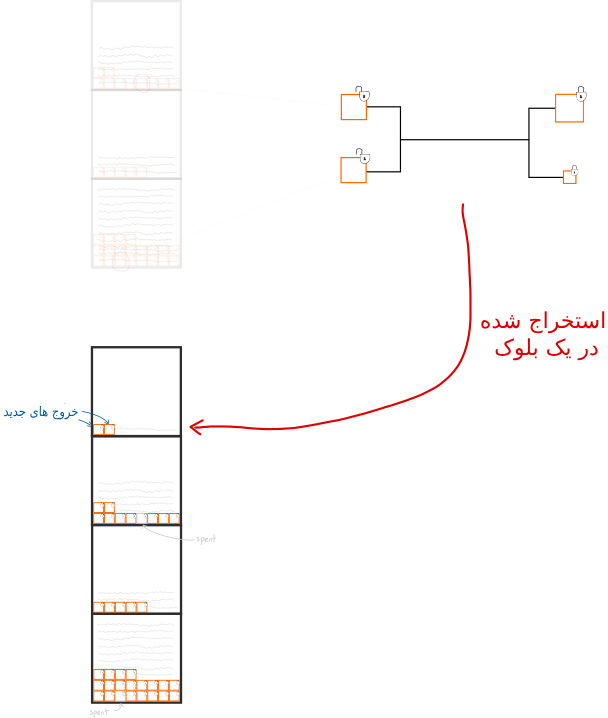
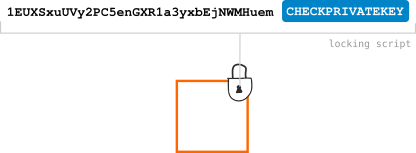

    <h1>قفل‌های خروجی</h1>
    
سازوکار قفل کردن خروجی‌های بیت‌کوین.

    <h2>فهرست</h2>
        

    <ul>
        <li>
            
<a href="#1">قفل خروجی چیه؟</a>

        </li>
        <li>
            
<a href="#2">این قفل‌ها از کجا میان؟</a>

        </li>
        <li>
            
<a href="#3">چطوری می‌شه یه قفل خروجی ایجاد کرد؟</a>

        </li>
        <li>
            
<a href="#4">چطوری می‌شه قفل خروجی رو باز کرد؟</a>

        </li>
    </ul>
    

    

    <h2 id="1">قفل خروجی چیه؟</h2>
    
قفل خروجی یک سری پیش‌نیاز گذاشته شده روی خروجیه. این به این معنیه که باید اول این پیش‌نیازها رفع بشه تا بشه خروجی رو توی یه تراکنش استفاده کرد.

    
برای مثال رایج‌ترین حالت قفل خروجی چیزی شبیه به اینه:

        
    
این قفل‌هان که جلوی ما رو می‌گیرن که نتونیم خروجی همدیگه رو تو تراکنش خرج کنیم، چون حالا روی هر خروجی یه قفل زده شده.

     
    <h2 id="2">
        این قفل‌ها از کجا میان؟
    </h2>
    
همونطور که می‌دونیم، یه تراکنش فرآیند برداشتن خروجی‌های موجود و ساخت خروجی‌های جدید از اونهاست:

        
    
در این حین ساخت این خروجی‌هاست که روی هر کدوم یه قفل می‌ذاریم:

      
    
ساخت خروجی‌های جدید و قفل زدن روی هر کدام.

      
    
 پس وقتی مثلا می‌خواهیم این رو برای دوستمون بفرستیم، خروجی جدید رو ایجاد می‌کنیم و روش یک قفل می‌زنیم که می‌گه «تنها مالک آدرس 1friend1234567890  (دوست ما) می‌تونه این خروجی رو استفاده کنه».

      
    
تمام این‌ها تو اطلاعات تراکنش ثبت شده.

      
    
نتیجه اینه که این خروجی جدید در عمل فقط به دوستمون «تعلق» داره، چون تنها کسیه که کلید خصوصی این آدرس رو داره پس هیچ کس دیگه‌ای نمی‌تونه خروجی رو خرج کنه.

    <blockquote>
    
همونطور که احتمالا متوجه شدی، هرگز واقعا بیت‌کوین در یه تراکنش «ارسال» نمی‌کنی.

    
بجاش یه تراکنش می‌سازی که خروجی جدید (با قفل جدید) ایجاد می‌کنه و این داده‌ی تراکنش رو به شبکه بیت‌کوین ارسال می‌کنی و منتظر می‌مونی که استخراج‌کننده‌ها تراکنش رو توی یک بلوک استخراج کنند.

        
    
پس هرچند که زنجیره‌بلوک یک فایل از تراکنش‌هاست، اما از سطح کاربردی می‌شه بهش به عنوان واحد انبار خروجی‌ها نگاه کرد.

        
    
زمانی که بیت‌کوین‌های «خودت» رو برای کسی می‌فرستی، به خروجی‌های درون زنجیره که می‌تونی خرج کنی اشاره می‌کنی.

        
    
زمانی که این تراکنش در زنجیره‌بلوک استخراج شد، دیگه این خروجی‌هایی که (به عنوان ورودی) استفاده کردی قابل استفاده دوباره نخواهند بود.

      
    
هر بلوک تراکنش یک سری خروجی تازه به زنجیره‌بلوک اضافه می‌کنه.
   
    
پس زنجیره‌بلوک تمام خروجی‌ها رو در خودش ذخیره می‌کنه و هر زمان که بخوای می‌تونی هر کدوم ازشون رو استفاده کنی، البته اگه بتونی قفلشون رو باز کنی. 

    </blockquote>
    

     
    <h2 id="3">چطوری می‌شه یه قفل خروجی ایجاد کرد؟</h2>
    
ققل خروجی در یک زبان برنامه‌نویسی ابتدایی به نام اسکریپت نوشته می‌شه.

    
توضیح دادن سازوکار یه زبان برنامه‌نویسی کامل با یه نمودار کمی مشکله، اما به هر حال یه چیزی شبیه به اینه:

      
    
به قفلی که برنامه‌نویسی می‌کنیم می‌گیم اسکریپت قفل کننده.
  
    
حالا جالب‌ترین بخش این اسکریپت قفل کننده کلیدواژه‌ی CHECKPRIVATEKEY است، که یه تابعه که ازش برای تعریف پیش‌نیازهای قفل کمک می‌گیریم.

    
در مثال بالا برای نمونه ما قفلی رو گذاشتیم که آدرس 1EUXSxuUVy2PC5enGXR1a3yxbEjNWMHuem  رو می‌خواد با یه کلید خصوصی مقایسه کنه،

    
 اگر بتونیم به این قفل یه کلید خصوصی منطبق ارائه بدیم می‌تونیم این قفل رو باز کنیم و توی یه تراکنش ازش استفاده کنیم.

     
    <h2 id="4">چطوری می‌شه قفل خروجی رو باز کرد؟</h2>
    
زمانی که داده‌های تراکنش رو می‌سازی، بعد از هر خروجی‌ای که می‌خوای استفاده کنی یه «اسکریپت باز کننده» می‌ذاری:

        
    
پس مثلا برای باز کردن یه اسکریپت قفل کننده‌ی معمولی (مثل: [CHECKPRIVATEKEY][آدرس] )، باید نشون بدیم که [آدرس] رو داریم برای اثبات این کار، با کلید خصوصیمون یه امضای دیجیتال می‌سازیم.

      
    
امضای دیجیتالت رو به عنوان اسکریپت باز کننده قرار می‌دی.

      
    
زمانی که یه گره این داده‌های ارسالی رو دریافت می‌کنه، میاد اسکریپت‌های «قفل کننده»+«باز کننده» رو با هم اجرا می‌کنه که بررسی کنه امضای دیجیتال با آدرسی که خروجی باهاش قفل شده مطابقت داره یا نه.

        
    
اگه همه چیز اوکی باشه گره تراکنش رو قبول می‌کنه و اون رو به گره‌های دیگه می‌فرسته که هر کدوم از اون‌ها هم پیش از پذیرش تراکنش اسکریپت‌ «قفل کننده»+«باز کننده» رو اجرا می‌کنن.

    
و اینطوری می‌شه یه قفل خروجی رو باز کرد.

     
    <h3>چی شد؟ کلید خصوصی رو که رو لو دادیم!</h3>
    
آفرین به این حواس جمع.

    
اعتراف: ما درواقع کلید خصوصی خودمون رو در داده‌های تراکنش قرار نمی‌دیم.

    
برای اینکه کلید خصوصی خودمون رو داخل داده‌های تراکنش لو ندیم، یه چیزی به اسم «امضای دیجیتال» می‌سازیم.

      
    
از کلید خصوصی‌مون استفاده می‌کنیم که یه امضای دیجیتال بسازیم.
  
    
مشخصه که در مورد تابعی که استفاده می‌کنیم هم دروغ گفته بودم. اما ترسی نداره، در واقع یه تابع دیگه هست که [آدرس] رو با [امضای دیجیتال] مقایسه می‌کنه؛ که بهش می‌گن  CHECKSIG.

      
    
همچنان مشکلمون رو حل می‌کنه.
  
    
پس به لطف جادوی امضای دیجیتال و تابع CHECKSIG، هم می‌تونیم خروجی‌هامون رو به آدرس‌ها قفل کنیم و هم بدون لو دادن کلید خصوصی‌مون بازشون کنیم .

    
همیشه یادمون باشه کلید خصوصی خیلی خیلی خیلی خیلی مهمه و باید بسیار مراقب اون باشیم چون هر کسی اون رو داشته باشه دسترسی به کیف پولمون داره!

    
یه فرآیند کامل و عالی!

    
<a href="https://learnmeabitcoin.com/beginners/guide/locks/">منبع</a>

    
به یادش: بسیار سفر باید تا پخته شود خامی

    
تمومه این قسمت !

    
شاد زی..

