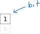
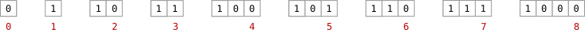
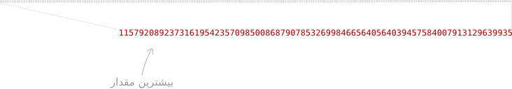
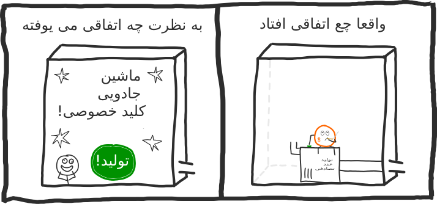
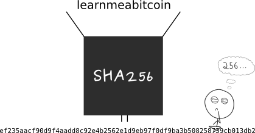

    <h1>کلید خصوصی</h1>
    
عددای بزرگِ تصادفی ساخته شده.

    <h2>فهرست</h2>
    

    <ul>
        <li>
            
<a href="#1">کلید خصوصی چیه؟</a>

        </li>
        <li>
            
<a href="#4">کلید خصوصی از کجا میاد؟</a>

        </li>
        <li>
            
<a href="#5">اگه یه نفر عین کلید خصوصی من رو ایجاد کنه، اون‌وقت چی؟</a>

        </li>
    </ul>
    

    

    <h2 id="1">کلید خصوصی چیه؟</h2>
    
کلید خصوصی یه عدده که به‌صورت تصادفی ایجاد می‌شه.

    <h6>مثال</h6>
    
یک کلید خصوصی:

    
108165236279178312660610114131826512483935470542850824183737259708197206310322

    
اگه بخوایم دقیق‌تر بگیم، چون بیت‌کوین از اعداد ۲۵۶بیتی استفاده می‌کنه، یه کلید خصوصی که به‌صورت تصادفی ایجاد شده
        این‌طوری شروع می‌شه:

    <h6>مثال</h6>
    
دودویی (باینری)

    
1110111100100011010110101010110011111001000011011001111101001010101011011101100011001001001011100100101100100101011000101110000111011001111010111001011111110000110111111001101110100011101101010000100000100101100001110011100111001011000000010011110110110010
    

    
این همچنان یه عدده، فقط به‌صورت دودویی نوشته شده، که روشی برای ذخیره‌سازی اعداد در کامپیوتره. چون همون‌طور که
        می‌دونید، بیت‌کوین در نهایت یه نرم‌افزار کامپیوتریه.

    
به‌هرحال، ما می‌تونیم این عدد دودویی رو به‌راحتی به ده‌دهی (دسیمال) تبدیل کنیم:

    <h6>مثال</h6>
    
ده‌دهی

    
108165236279178312660610114131826512483935470542850824183737259708197206310322

    
یا به شکل شانزده‌شانزدهی:

    <h6>مثال</h6>
    
شانزده‌شانزدهی

    
ef235aacf90d9f4aadd8c92e4b2562e1d9eb97f0df9ba3b508258739cb013db2

    
همه‌ی این شکل‌ها یه عددن و هیچ تفاوتی بین اون‌ها نیست. ‌در واقع، همه‌ی اون‌ها کلید خصوصی یکسانی رو نشون می‌دن ولی
        به شکل‌های مختلف.

    
 چون در نهایت کلید خصوصی تنها یک عدده.

    
به‌طورمعمول، کلید خصوصی خام رو به‌صورت شانزده‌شانزدهی نشون می‌دن.

     
    <blockquote>
        <h3 id="2">اعداد ۲۵۶بیتی چی‌اند؟</h3>
        
عدد ۲۵۶بیتی، عددیه که می‌شه در ۲۵۶ بیت داده ذخیرش کرد.

         
        <h3 id="3">بیت چیه؟</h3>
        
کوچک‌ترین واحدی که در کامپیوتر وجود داره بیت نامیده می‌شه.

        <table style="display: block; margin-left: auto; margin-right: auto;">
            <tr>
                <th>واحد</th>
                <th>اندازه</th>
            </tr>
            <tr>
                <td>گیگابایت</td>
                <td>1024 مگابایت</td>
            </tr>
            <tr>
                <td>مگابایت</td>
                <td>1024 کیلوبایت</td>
            </tr>
            <tr>
                <td>کیلوبایت</td>
                <td>1024 بایت</td>
            </tr>
            <tr>
                <td>بایت</td>
                <td>8 بیت</td>
            </tr>
            <tr>
                <td>بیت</td>
                <td></td>
            </tr>
        </table>
         
        
‌در واقع، یه بیت اونقدر کوچیکه که فقط می‌تونه مقدار 0 یا 1 رو در خودش نگهداری کنه.

            
        
بااین‌حال، از بیت‌ها می‌شه برای نشون‌دادن انواع دیگه‌ای از داده‌ها هم استفاده کرد، مثل اعداد روزمره.

        
برای مثال، در اینجا، چگونگی ذخیره‌شدن چند عدد مختلف رو در کامپیوتر نشون می‌دیم:

            
        
یه عدد ۲۵۶بیتی عددیه که می تونه با استفاده از حداکثر ۲۵۶ بیت نمایش داده بشه.

            
        
یا به عبارت دیگه، یه عدد ۲۵۶بیتی بین مقادیر زیره:

        
کمینه: 0

        
بیشینه: 115792089237316195423570985008687907853269984665640564039457584007913129639935

        
بنابراین، همون‌طور که می‌بینی، ۲۵۶ بیت بهت اجازه می‌ده که از اعداد خیلی بزرگ استفاده کنی.

        
 این بودن اعداد ۲۵۶بیتی—اعدادی که داخل ۲۵۶ بیت از داده جا می‌شن.

        
تعداد کل اعداد ۲۵۶بیتی برابره با ۲۵۶^۲ (یا ۲ به توان ۲۵۶).

    </blockquote>
     
    <h2 id="4">کلید خصوصی از کجا میاد؟</h2>
    
دروغ نمی‌گفتم وقتی داشتم می‌گفتم کلیدهای خصوصی به‌صورت تصادفی ایجاد می‌شن.

    
راستش رو بخوای، از هر نوع نرم‌افزار بیت‌کوین که برای تولید کلید خصوصی استفاده کنی، جادو و جنبل نمی‌کنه؛ فقط یه
        عدد ۲۵۶بیتی تصادفی بهت می‌ده.

        
    
بنابراین، هیچ دلیلی وجود نداره که نتونی کلید خصوصی خودت رو ایجاد کنی. فقط باید بتونی یه عدد ۲۵۶بیتی تصادفی ایجاد
        کنی.

    
این کار رو می‌تونی به چند روش مختلف انجام بدی:

     
    <h3>مثال</h3>
    <ol>
        <li>۲۵۶ بار سکه بنداز</li>  
        
        
این بهت یه کلید خصوصی به شکل دودویی می‌ده.
  
        <li>از زبان برنامه‌نویسی موردعلاقه‌ت برای تولید عدد تصادفی استفاده کن.</li>
         
        <figure>
            <code>
        <h4 dir="ltr">Python</h4>
        
# برای امنیت نیازه که از عدد تصادفی ساز سیستم عامل استفاده بشه.

        
import random

        
random.SystemRandom().randint(1, 115792089237316195423570985008687907852837564279074904382605163141518161494336)

        </code>
            <figcaption>
                
این بهت یه کلید خصوصی به شکل ده‌دهی می‌ده.

            </figcaption>
        </figure>
        <li>یه داده‌ای رو با تابع درهم‌سازی SHA256 درهم کن.</li>  
        
        
این بهت یه کلید خصوصی به شکل شانزده‌شانزدهی می‌ده.

    </ol>
    
همه‌ی این روش‌ها بهت یه عدد تصادفی ۲۵۶بیتی می‌دن. و اگه یه عدد ۲۵۶بیتی داشته باشی، یه کلید خصوصی داری.

     
    <blockquote>
        <h3>مطمئن بشید که عددی که گرفتید به‌صورت کاملاً تصادفی ایجاد شده باشه.¹</h3>
        
اگه از روشی استفاده کنی که مطمئن نباشی خروجی‌ای که می‌ده یه عدد کاملاً تصادفیه (برای مثال، برای تولید عدد
            تصادفی از الگوهای مشخصی استفاده کنه)، خودت رو در معرض آسیب‌پذیری، در برابر کسی که از ایراد این عدد تصادفی
            ساز خبر داره، قرار دادی.

        
و اگه کسی توانایی ساخت دوباره‌ی کلید خصوصیت رو داشته باشه، می‌تونه به بیت‌کوین‌هات دسترسی پیدا کنه.

        
در نتیجه، همه‌ی آموزش‌ها مدام تأکید می‌کنن و به‌نوعی تو رو از بابت تولید کلید خصوصی می‌ترسونن چون کسی
            نمی‌خواد مسئول
            اشتباه‌های تازه‌واردانه‌ی تو باشه.

        
نذار ترس جلوت رو بگیره، اگر تازه‌کار نباشی و بفهمی داری چیکار می‌کنی مشکلی نخواهی داشت.

        <blockquote>
            
قراردادن کلمه‌ی bitcoin در تابع درهم‌سازی SHA256 (و استفاده‌ش به‌عنوان کلید خصوصی) بیشتر کمدیه تا تصادفی.
            

        </blockquote>
        <blockquote>
            
اگه هنوز مطمئن نیستی، ۲۵۶ بار سکه بنداز. حالت تصادفی‌تری از این حالت نمی‌تونی داشته باشی.

        </blockquote>
    </blockquote>
    
این واقعیت که هر کسی می‌تونه «حساب بیت‌کوین» خودش رو ایجاد کنه، اون هم تنها با ایجاد یه عدد تصادفی، یکی از
        ویژگی‌های دوست‌داشتنی بیت‌کوینه. این به این معنیه که هیچ‌ کسی کنترلی روی صدور حساب‌ها نداره؛ بنابراین، بیت‌کوین
        برای هر کسی که بتونه یه عدد ۲۵۶بیتی ایجاد کنه آزاد و در دسترسه.

     
    <h2 id="5">اگه یه نفر عین کلید خصوصی من رو ایجاد کنه، اون‌وقت چی؟</h2>
    
اگه این اتفاق بی‌افته، اون فرد می‌تونه بیت‌کوین‌های تو رو به‌سرقت ببره.

    
ولی نگران نباش، هیچ‌کسی نمی‌تونه به‌صورت تصادفی کلید خصوصی‌ای مثل کلید خصوصی تو ایجاد کنه.

     
    <h3 id="6">مگه می‌شه نتونن، حتماً می‌تونن؟</h3>
    
ببینید، همون کلید خصوصی رو در آوردن از نظر تئوری ممکنه، اما با توجه به گستره‌ی وسیعی که برای کلید خصوصی وجود
        داره، این کار به‌شدت سخته و ‌در واقع این‌قدر مشکله که «بعید» محسوب می‌شه.

    
برای مثال، اگه من یه میلیون میمون داشتم که هرکدوم در هر ثانیه یه میلیون کلید خصوصی ایجاد می‌کردن (خوب تربیتشون
        کردم)، چیزی حدود ۳٬۶۷۱٬۷۴۳٬۰۶۳٬۰۸۰٬۸۰۲٬۷۴۶٬۸۱۵٬۴۱۶٬۸۲۵٬۴۹۱٬۱۱۸٬۳۳۶٬۲۷۷٬۱۹۳٬۱۸۴٬۹۰۲٬۱۷۲ سال² طول می‌کشید
        تا یکی از میمون‌های من بتونه کلید خصوصی تو رو پیدا کنه.

    
من که نه زمانش رو دارم نه قدرت میمونیش رو. هیچ کس دیگه‌ای هم نداره.

    <blockquote>
        
اونقدر کلید خصوصیِ ممکن هست که تصادفی انتخاب کردن یکیش، به خودی خود امنیته.

    </blockquote>
     
    <h3 id="7">قانع شدم.</h3>
    
هنوز حرفم تموم نشده.

    
گستره‌ی اعداد ۲۵۶بیتی (و در نتیجه اعدادی که ممکنه کلید خصوصی باشن) خیلی بیش‌ از حد تصور بزرگه. همون‌طور که برای
        ذهن انسان غیرممکنه که مقیاس جهان رو تصور کنه، در اینجا هم ذهن انسان برای تجسم گستره‌ی ۲۵۶ بیت دشواری داره
        و غیرممکنه که بتونه همچین محدوده‌ای از اعداد رو تصور کنه.

    
بنابراین، اگه هر نوع تردیدی در مورد امنیت عدد ۲۵۶بیتی خودت داری، یا به این دلیله که از یه تولیدکننده‌ی عدد تصادفی
        قابل اطمینان استفاده نکردی، و یا اینکه درک نکردی که با چه حجم بزرگی از اعداد در این قسمت روبه‌روییم.

    <h3>پاورقی</h3>
    <ol>
        <li>¹ هیچ چیزی کاملاً تصادفی نیست، اما همی‌شه باید بهترین‌ها رو انتخاب کنی.</li> 
        <li>² نحوه‌ی محاسبه‌ی مدت زمان بالا:</li>
         
        <code>
        <h4 dir="ltr">Python</h4>
        
keys = 115792089237316195423570985008687907852837564279074904382605163141518161494336

        
monkeys = 1000000

        
monkeyhashrate = 1000000

         
        
keyspersecond = monkeys * monkeyhashrate

         
        
seconds = keys / keyspersecond

        
minutes = seconds / 60

        
hours = minutes / 60

        
days = hours / 24

        
years = days / 365

        
millionyears = years / 1000000
 
        
print millionyears

        </code>
    </ol> 
    
<a href="https://learnmeabitcoin.com/beginners/guide/private-keys/">منبع</a>

    
<a href="https://github.com/rezatajari/learnmeabitcoin/blob/master/08.%20Public%20Keys.md">رفتن به مطلب بعد</a>
    

